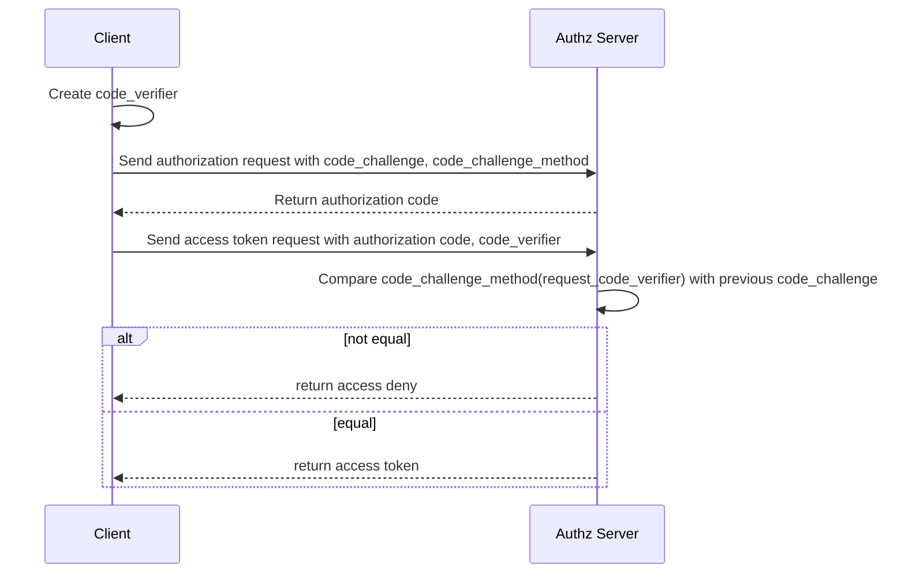
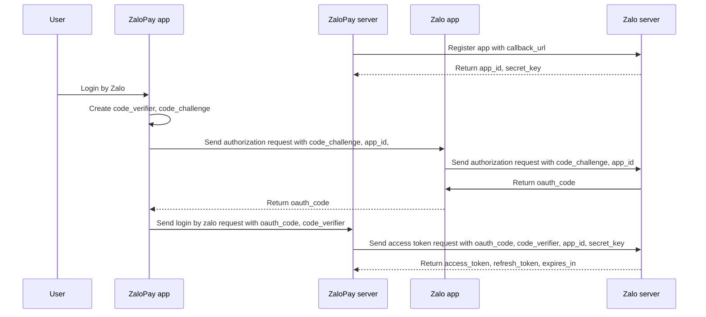
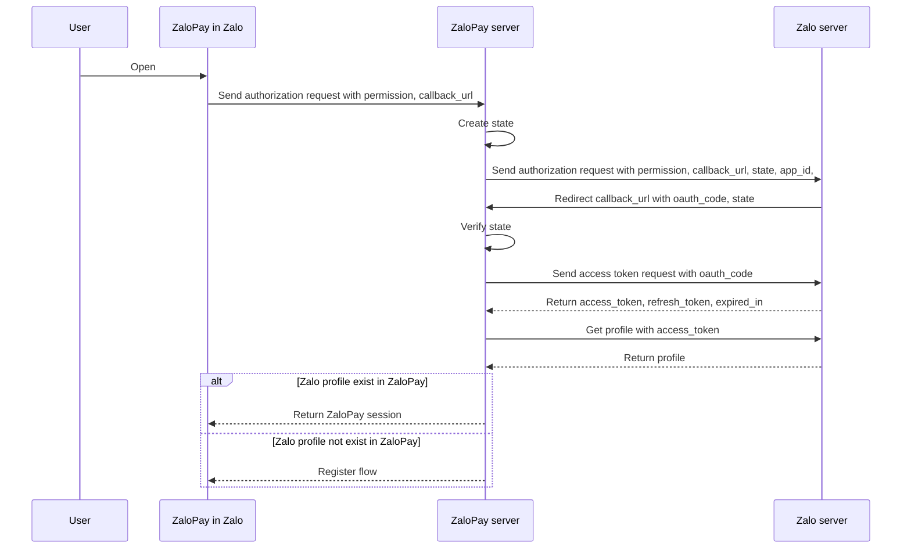
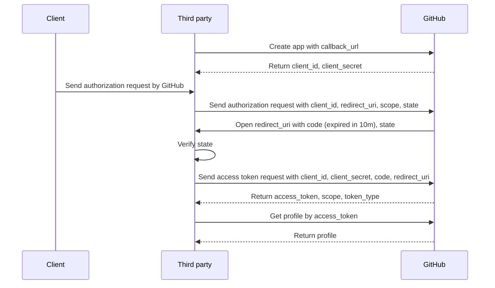

# 01_deep_dive

## Unicode

Unicode is a table which assign **character** (a, b, c, emoji, ...) to number
aka **code point**.

Private Use is up to developer to define, Unicode does not define that global.
For example icon fonts.

UTF-8 is **variable-length** encoding. Each character can be encoded to 1, 2, 3
or 4 bytes.

- English is encoded using 1 bytes.
- Chinese, Japanese, Emoji need 3 or 4 bytes.

ASCII is compatible with UTF-8 because ASCII using code points 0..127 which is
exact 1 byte and represents same character in UTF-8. So pure ASCII text is also
valid UTF-8 text.

U don't want to work with code points, u need to work with graphene. A graphene
is the smallest distinct unit of writing in specific context.

- `ả`, `ẻ` is a graphene in Vietnamese text.

The problem is 1 graphene can be encoded by many code points (No limit). So many
programming languages show that length of 1 graphene can be more than 1. But
human only count as 1.

Sometimes, same character can be encoded multiple way, 1 code point or combined
2 code points. So there need some **normalization** to guarantee that a
character is always represented by **same** code points.

|                           | Composing | Decomposing |
| ------------------------- | --------- | ----------- |
| Canonical equivalence     | NFC       | NFD         |
| Compatibility equivalence | NFKC      | NFKD        |

Go rune is code point in `int32` because Unicode code point can be up to 4 bytes
aka (2^8)^4 = 2^32.

The following creates a `transform.Transformer` that decomposes text into its
smallest parts, removes all accents, and then recomposes the text into NFC:

```go
import (
    "unicode"

    "golang.org/x/text/transform"
    "golang.org/x/text/unicode/norm"
)

isMn := func(r rune) bool {
    return unicode.Is(unicode.Mn, r) // Mn: nonspacing marks
}
t := transform.Chain(norm.NFD, transform.RemoveFunc(isMn), norm.NFC)
```

### References

- [The Absolute Minimum Every Software Developer Must Know About Unicode in 2023 (Still No Excuses!)](https://tonsky.me/blog/unicode/)
- [It’s Not Wrong that `"🤦🏼‍♂️".length == 7`](https://hsivonen.fi/string-length/)
- [Text normalization in Go](https://go.dev/blog/normalization)
- [Strings, bytes, runes and characters in Go](https://go.dev/blog/strings)
- [UTF-8: Bits, Bytes, and Benefits](https://research.swtch.com/utf8)
- [Hello World or Καλημέρα κόσμε or こんにちは 世界](https://9p.io/sys/doc/utf.html)
- [Flexible and Economical UTF-8 Decoder](https://bjoern.hoehrmann.de/utf-8/decoder/dfa/)
- [Decoding UTF8 with Parallel Extract](https://nrk.neocities.org/articles/utf8-pext)

## Rate limit

### Token bucket / Leaky bucket

Each user has bucket with default token count. Each time user arrives, bucket
**decrease** token count. After some time, bucket get **refill** with default
token count.

Implement:

- Save timestamp user arrives and current token count.
- If user arrives, check if user bucket need to refill base on timestamp, then
  decrease token count.
- If token count reach 0 then user hit/exceed rate limit.

Consider:

- Read (current token count) then write (refill/decrease token count) is
  problematic in distributed system.
  - User A hit 2 requests at the same time, then system read current user token
    count at the same time (== 1) then 2 requests shall pass but it should not.
  - Need to use **distributed lock**.

### Fixed window counters

Divide time to duration (each minute, each 30s, ...). In each duration, user has
default limit token count, initially 0. Each time user arrives, **increase**
user duration token count.

Implement:

- If user arrives, round arrive timestamp to timestamp of start duration, then
  use that at a key.
  - Check if key is exist or not, if not then user token count is 0, otherwise
    user token count is key value.
  - Increase token count.
- If token count reach default limit then user hit rate limit.
- The key is only valid in duration so we need to delete old key. Because 1 user
  arrives in different time can create many different keys.

Consider:

- Because Redis allow increase and return value in atomic operation so we don't
  need distributed lock.
- Use Redis expired to auto delete old key.
- Problem is user can bypass up to **2x** default limit, because we only count
  in 1 duration, if user fires all requests near the end of duration, then fires
  another after the start of new duration then we let it through.

### Sliding window log

Track all timestamp of user requests in a sorted sets.

Implement:

### References

- [An alternative approach to rate limiting](https://www.figma.com/blog/an-alternative-approach-to-rate-limiting/)
- [Designing and implementing a sliding window based rate limiter](https://arpitbhayani.me/blogs/sliding-window-ratelimiter)

## OAuth

[PKCE: What and Why?](https://dropbox.tech/developers/pkce--what-and-why-)

> PKCE provides dynamic client secrets, meaning your app’s client secrets can
> stay secret (even without a back end for your app). PKCE is better and more
> secure than the implicit flow (AKA the “token flow”).

- `code_verifier`: random string
- `code_challenge`: `base64_rawurl_encode(sha256(code_verifier))`

[Proof Key for Code Exchange by OAuth Public Clients](https://www.rfc-editor.org/rfc/rfc7636.html)



[The OAuth 2.0 Authorization Framework](https://www.rfc-editor.org/rfc/rfc6749)

[OAuth 2.0 for Native Apps](https://www.rfc-editor.org/rfc/rfc8252)

- `state`: for third party to prevent CSRF attack

[Zalo User Access Token V4](https://developers.zalo.me/docs/social-api/tham-khao/user-access-token-v4)





[GitHub Authorizing OAuth apps](https://docs.github.com/en/apps/oauth-apps/building-oauth-apps/authorizing-oauth-apps)



### References

- [Why is OAuth still hard in 2023?](https://www.nango.dev/blog/why-is-oauth-still-hard)
- [IRC × OAuth 2.0](https://emersion.fr/blog/2022/irc-and-oauth2/)
- [JWT Security Best Practices](https://curity.io/resources/learn/jwt-best-practices/)
- [Stop using JWT for sessions](http://cryto.net/~joepie91/blog/2016/06/13/stop-using-jwt-for-sessions/)
- [Stop using JWT for sessions, part 2: Why your solution doesn't work](http://cryto.net/%7Ejoepie91/blog/2016/06/19/stop-using-jwt-for-sessions-part-2-why-your-solution-doesnt-work/)
- [Tailescale: Introducing Custom OIDC](https://tailscale.com/blog/custom-oidc)
- [The Copenhagen Book](https://github.com/pilcrowonpaper/copenhagen)

## [RAFT Consensus Algorithm](https://raft.github.io/)

Replicated state machines is implemented by replicated logs. It is
deterministic.

…, y = 1, x = 2, y = 3, x = 3 → final x = 3, y = 3

Mission of consensus algorithm is keeping replicated logs consistent.

Each servers with same replicated logs will produce same results → consistent.

First choose leader → give it all the control of replicated logs.

Clients push logs leader → Leader replicates to other servers then tell servers
when is safe to play replicated logs (Log replication).

Leader decide without consulting other servers.

If leader fail → find another leader (Leader election).

Each server has 3 states: **leader**, **follower**, **candidate.**

Nomal: 1 leader, others are followers.

Clients make a request to followers → followers redirect to leader.

Time is devided into **terms**.

Term begins with election.

- If a candidate win → become leader.
- If split vote (50/50 I guess) → no leader → init new term shorly after.

Terms act as logical clock. Each server stores current term number, which
increases over time.

Server exchange server with term number. The bigger term number, the more
powerful.

A (term 2) exchange B (term 3) → update A to term 3.

A (term 2) is leader, candidate but found out B (term 3) → update A to follower.

A (term 2) request B (term 3) to update something → B rejects.

Server exchange server using 2 RPC:

- RequestVote
- AppendEntries

## Load balancer

### Round-Robin

Naive approach, first request to first server, second request to second server,
... and so on.

No need to keep state, just fair distribution.

If a server is down, all current and future requests to that server will fail.

### Least Connections

TODO

### Power of Two Choices

TODO

### References

- [The Power of Two Random Choices: A Survey of Techniques and Results](https://www.eecs.harvard.edu/~michaelm/postscripts/handbook2001.pdf)
- [NGINX and the “Power of Two Choices” Load-Balancing Algorithm](https://www.nginx.com/blog/nginx-power-of-two-choices-load-balancing-algorithm/)
- [Load Balancing: The Intuition Behind the Power of Two Random Choices](https://medium.com/the-intuition-project/load-balancing-the-intuition-behind-the-power-of-two-random-choices-6de2e139ac2f)

## Data structure

### Priority queue

Enqueue: add to tail

Dequeue:

- Travese all to get max priority → remove that → O(n)
- Use heap data structure → O(logn)
  - Each time enqueue priority, if not bigger priority than it stays behind →
    preserver the order

### Heap data structure

Min heap: root is the min aka arr[0]

arr[i] has children arr[2 * i] and arr[2 * i + 1]

arr[i] always < its children

Add: add to the end of arr → heapify from bottom

Remove: remove from the begin of arr → put the end of arr to the top → heapify
from top

What is heapify? Rebalance:

- Heapify from bottom: compare arr[i] with it’s parent → if smaller than parent
  → swap
- Heapify from top: compare arr[i] with its children → if bigger then children →
  choose which is smallest → swap

### Swiss Table

TODO

#### References

- [CppCon 2017: Matt Kulukundis “Designing a Fast, Efficient, Cache-friendly Hash Table, Step by Step”](https://www.youtube.com/watch?v=ncHmEUmJZf4&t=1449s)
- [Swiss Tables Design Notes](https://abseil.io/about/design/swisstables)
- [Swisstable, a Quick and Dirty Description](https://faultlore.com/blah/hashbrown-tldr/)
- [GopherCon 2016: Keith Randall - Inside the Map Implementation](https://www.youtube.com/watch?v=Tl7mi9QmLns&t=596s)
- [SwissMap: A smaller, faster Golang Hash Table](https://www.dolthub.com/blog/2023-03-28-swiss-map/)
